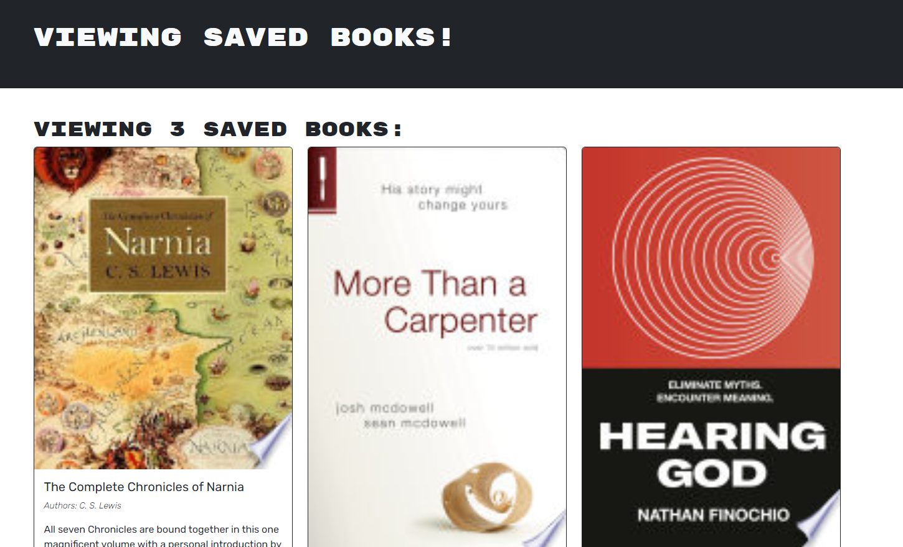

  # MERN Challenge: Book Search Engine

  [](https://opensource.org/licenses/MIT)

 
  ## Description
  This project is to test our skills for to implement graphql in our mern application
  <!-- Add a screenshot of your application here -->
  
  ## Deployed Site 
  https://powerful-lake-38678-121defdf325d.herokuapp.com/
  ## Table of Contents
  - [Installation](#installation)
  - [Usage](#usage)
  - [Credits](#credits)
  - [License](#license)
  - [Contribution](#how-to-contribute)
  - [Tests](#tests)
  - [Questions](#questions)
  
  ## Installation
  npm install and other dependencies
  
  ## Usage 
  ```
  GIVEN a book search engine
WHEN I load the search engine
THEN I am presented with a menu with the options Search for Books and Login/Signup and an input field to search for books and a submit button
WHEN I click on the Search for Books menu option
THEN I am presented with an input field to search for books and a submit button
WHEN I am not logged in and enter a search term in the input field and click the submit button
THEN I am presented with several search results, each featuring a book’s title, author, description, image, and a link to that book on the Google Books site
WHEN I click on the Login/Signup menu option
THEN a modal appears on the screen with a toggle between the option to log in or sign up
WHEN the toggle is set to Signup
THEN I am presented with three inputs for a username, an email address, and a password, and a signup button
WHEN the toggle is set to Login
THEN I am presented with two inputs for an email address and a password and login button
WHEN I enter a valid email address and create a password and click on the signup button
THEN my user account is created and I am logged in to the site
WHEN I enter my account’s email address and password and click on the login button
THEN I the modal closes and I am logged in to the site
WHEN I am logged in to the site
THEN the menu options change to Search for Books, an option to see my saved books, and Logout
WHEN I am logged in and enter a search term in the input field and click the submit button
THEN I am presented with several search results, each featuring a book’s title, author, description, image, and a link to that book on the Google Books site and a button to save a book to my account
WHEN I click on the Save button on a book
THEN that book’s information is saved to my account
WHEN I click on the option to see my saved books
THEN I am presented with all of the books I have saved to my account, each featuring the book’s title, author, description, image, and a link to that book on the Google Books site and a button to remove a book from my account
WHEN I click on the Remove button on a book
THEN that book is deleted from my saved books list
WHEN I click on the Logout button
THEN I am logged out of the site and presented with a menu with the options Search for Books and Login/Signup and an input field to search for books and a submit button  
  ```
  
  ## Credits
  None
  
  ## License
  This project uses the [MIT License](https://opensource.org/licenses/MIT) license
  
  ## How to Contribute
  Email ME!
  
  ## Tests
  None
  
  ## Questions
  ### Github: https://github.com/chinosj89
  ### Email: raphael.sanjuan13@gmail.com
  
  ### ReadMe 
  ReadME created through personal ReadMe Generator from: https://github.com/chinosj89/cuddly-invention
